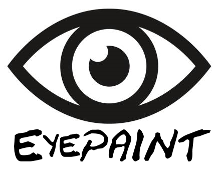

# EyePAINT

Don't pay attention. This isn't really finished.

## About

The software in this repository aims to provide a gaze estimation-based graphical user interface to drive a mechanical painting robot. Its goal being to produce a system that allows for the creation of paintings in a hands-free manner.

## Dependencies

- Python 3.6
- cmake
- dlib
- opencv
- mtcnn
- pygame
- rxpy
